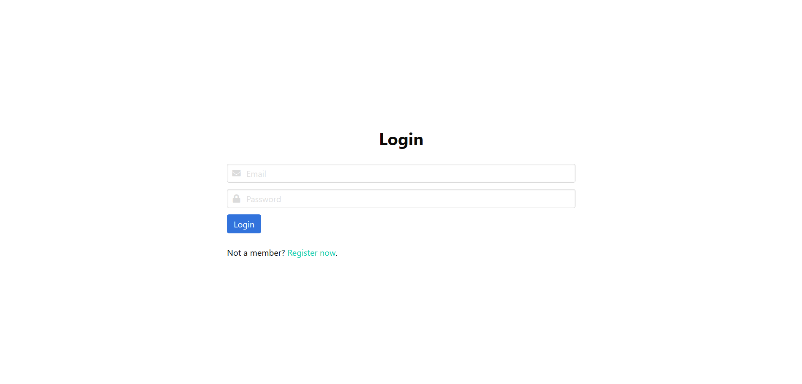
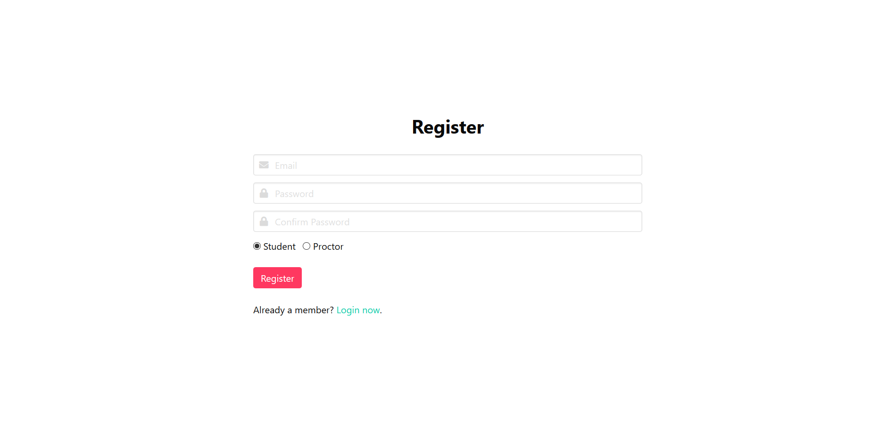
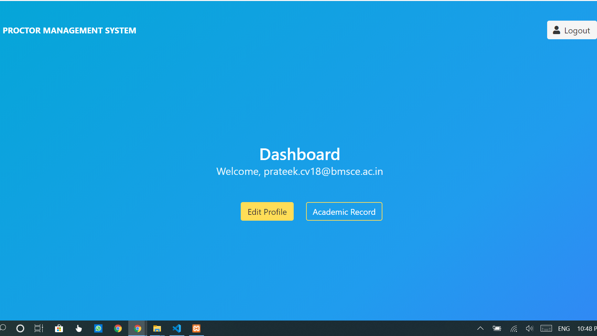
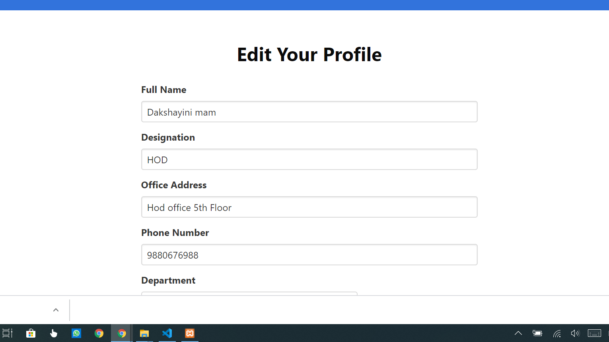
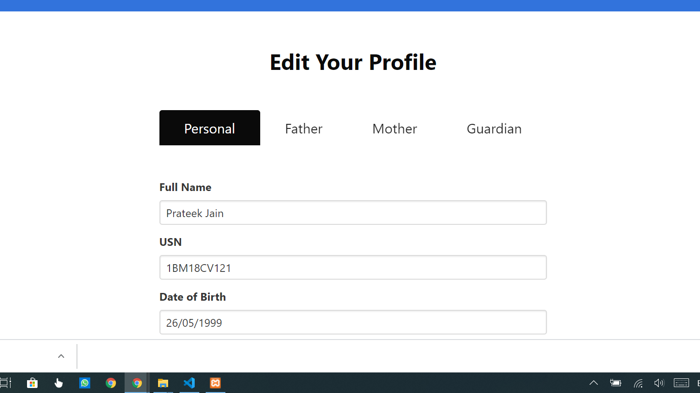
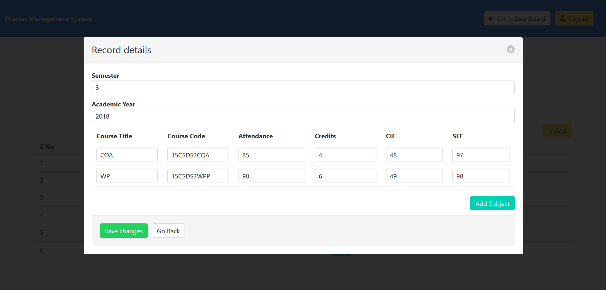
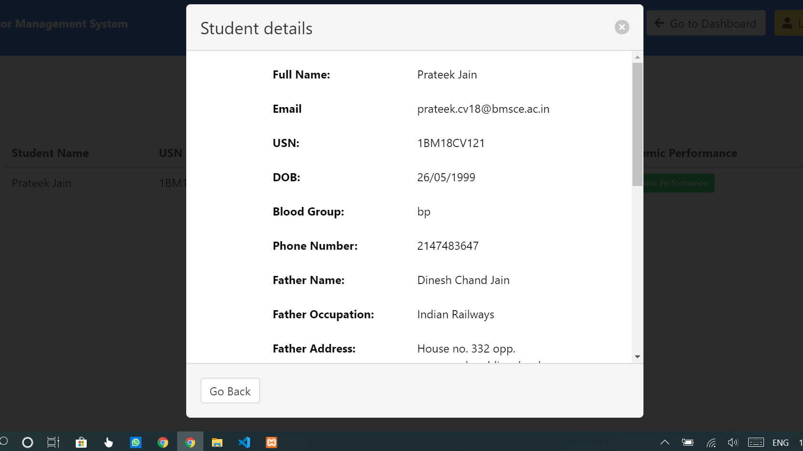
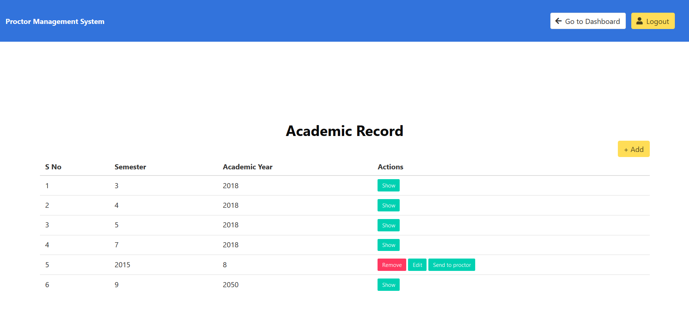
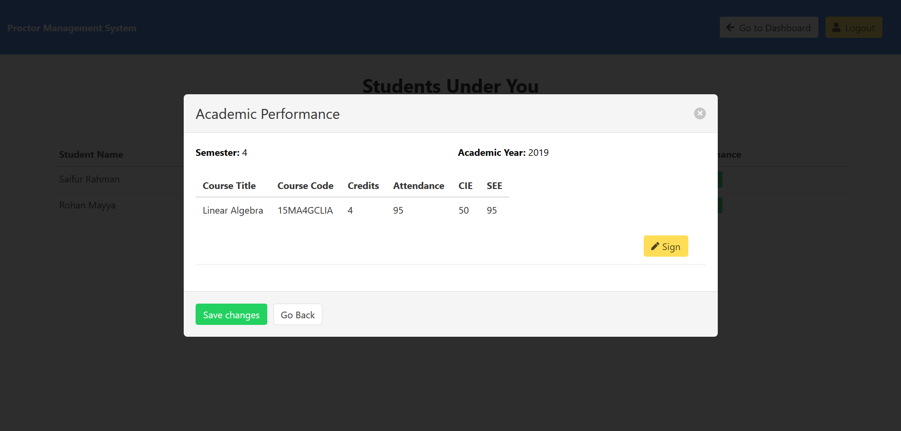

# Proctor Management System

A college proctor management system is a project that manages and stores proctee information electronically according to the proctor needs. This system helps both the proctor and proctee to keep a constant track of all the proctees under a particular proctor.

This portal enables us register as either a student or a proctor. If you’re logged in as a student, you can edit your profile and set your academic records per semester. You are allowed to set your proctor in the Edit Profile page as well. This means that you can set the marks obtained in each subject for each semester and then forward the same details to a proctor. Once the proctor has received a student’s request, he/she can go through the student details and academic performance and "Sign" the record so as to approve their work. There is a proctee page for each proctor which lists all the proctees under a specific proctor.

### This online submission system supports following users:
- Student
- Proctor

### Functionalities under Student login
- Register
- Login

Students can edit their profile, grades, choose their proctor and send their details for verification.

### Functionalities under Proctor login

- Edit Profile: Proctor can edit his or her own profile to match the needs.
- View List of Proctees: The proctor can view the list of proctees under him/her and all of the student’s personal details and academic record.
- "Sign" a student’s academic performance for a semester: Upon viewing a proctee’s details and academic performance, the proctor can put his or her signature (approval) on their performance for a semester to validate the student’s diary.

## Screenshots
### Login Screen

### Register Screen

### Dashboard

### Proctor Profile Screen

### Student Profile Screen

### Academic Record Screen

### Student Details as seen on the proctor’s side

### Semester Record Screen

### Approving academic record as a proctor

